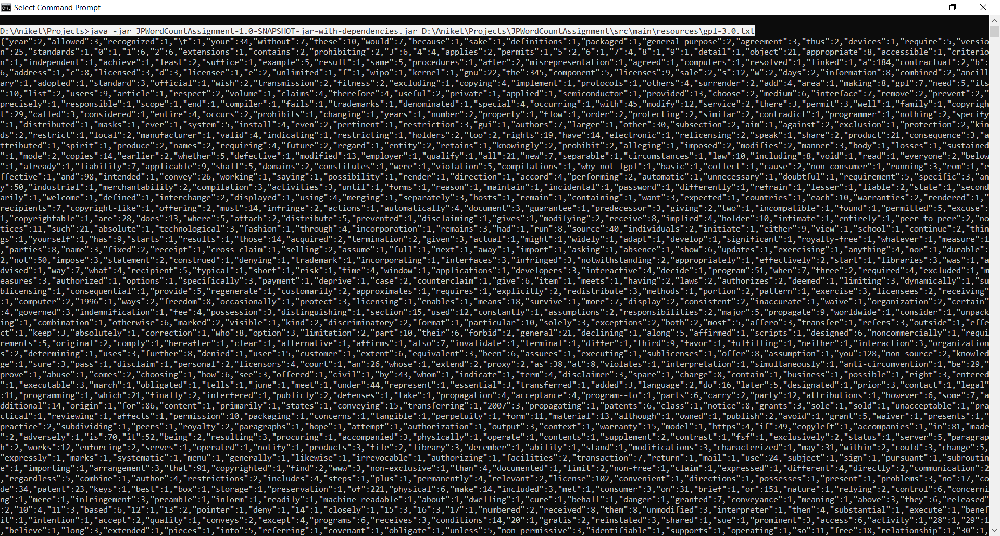
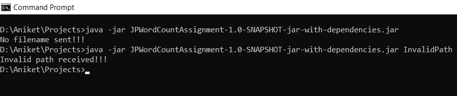
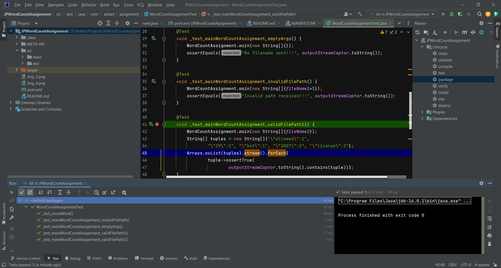

# Word Count Assignment

### Overview
Application loads file from the path sent and counts the unique words ignoring special characters.

### Libraries & Versions
1. JDK 16
2. json-20230618.jar
3. junit-jupiter-5.8.2.jar

### Guidelines
Application Run:
1. Clone the repo. which already has jar file created which can be run separately.
2. To run application execute below command from target folder:
   1. java -jar JPWordCountAssignment-1.0-SNAPSHOT-jar-with-dependencies.jar <FULLY_QUALIFIED_FILE_PATH>
3. There are tests written which can be run to validate the different scenarios including invalid ones.
4. While running the application the argument needs to be passed which should be the path of file which
needs to be processed.
5. The application accept file path and produces outputs as below:
   1. If the path sent as argument is empty or invalid appropriate message is displayed.
   2. If path is valid, Application loads the file and processes it line by line. Filters out characters apart from
   lower and upper letters and numbers, stores in map and prints out as json.
6. Parallel stream api is used to achieve parallel processing and Concurrent hashmap is used to avoid race condition.

### Testing
Test cases covers below scenarios:
1. File path is empty or invalid. Asserts if appropriate message is printed.
2. Asserts if the correct number of words are extracted from the file.
3. Tests if specific words with count are captured and special characters are not present in printed output.

### Result Screenshots & Evidences 
1.Running application with valid input (https://www.gnu.org/licenses/gpl-3.0.txt)

2. With empty input to application and with invalid file path

3. Running tests 

